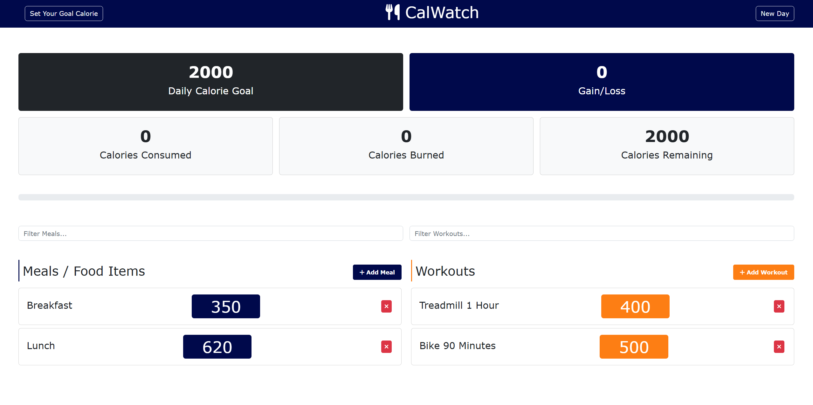

# CalWatch App

CalWatch is a straightforward calorie-tracking application developed using vanilla JavaScript. It helps you monitor your meals and workouts while calculating the total calories consumed and burned.

This project was created as part of _Brad Traversy's Modern JavaScript From The Beginning 2.0 course._

All the code and classes are contained within the app.js file.
